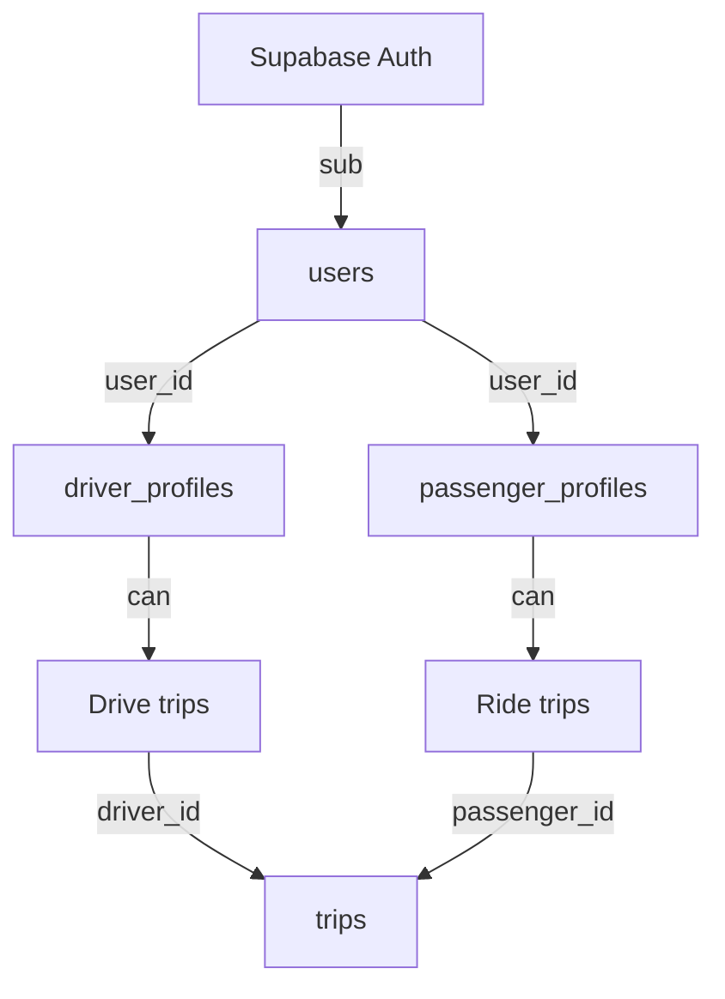

# Architecture Spine — Lifty Unified User Identity

## Design Paradigm

**Profile-per-Role.** A user is a Supabase Auth identity. They gain capabilities by creating *profiles* — zero, one, or two. A driver profile means they can drive. A passenger profile means they can ride. Both means both. No single `role` enum gatekeeps what a user can do.

```
Supabase Auth User (email/Google)
  │
  └── users (id, email, phone, full_name, avatar_url)
        │
        ├── [optional] driver_profiles (kyc, vehicle, onboarding, heartbeat, earnings)
        │
        └── [optional] passenger_profiles (payment_methods, favorites, ride_preferences)
```

## Invariants & Rules

### AD-1 — Identity is role-agnostic

- **Binds:** `users` table, `findOrCreateUser`, all services
- **Prevents:** Hardcoding `role: 'driver'` on user creation, forcing a single-role model that blocks dual-role users
- **Rule:** The `users` table carries identity fields only (`id`, `email`, `phone`, `full_name`, `avatar_url`). No role column is written at user creation time. A user exists independently of what they can do.

### AD-2 — Profile tables are the capability gate

- **Binds:** `drivers` table (existing), `passenger_profiles` (new), `requireRole` middleware
- **Prevents:** Mixing driver and passenger data in one table; checking a single varchar column for authorization
- **Rule:**  
  - `driver_profiles` (renamed from `drivers`): `user_id UNIQUE FK → users.id`. Created lazily on first driver profile update.  
  - `passenger_profiles` (new): `user_id UNIQUE FK → users.id`. Created lazily on first passenger registration.  
  - Authorization checks profile existence, not a role string. `requireRole` becomes `hasProfile('driver')` / `hasProfile('passenger')`.

### AD-3 — Role is derived, not stored

- **Binds:** auth middleware response (`AuthUser`), `GET /auth/me`, all role-checking code
- **Prevents:** Drift between stored role and actual profile state; role column as source of truth
- **Rule:** `user.role` is computed at read time:  
  ```
  hasDriverProfile && hasPassengerProfile → 'both'
  hasDriverProfile → 'driver'
  hasPassengerProfile → 'passenger'
  otherwise → null
  ```
  The `users.role` column is retained as a **cached denormalization** updated on profile create/delete, never the authority. Existing code reading `user.role` continues to work.

### AD-4 — Profiles are created by their owning service

- **Binds:** driver service (`features/drivers/service.ts`), passenger service (`features/passengers/service.ts` — new)
- **Prevents:** Cross-service profile mutation; unvalidated profile creation
- **Rule:**  
  - Driver profile: created by `DriversService.updateProfile()` on first call (existing behavior). Requires DIDIT KYC to advance past `step1`.  
  - Passenger profile: created by `PassengersService.register()` on first passenger sign-up. Requires email verified + terms accepted.  
  - No service touches the other's profile table.

### AD-5 — Migration is backward-compatible

- **Binds:** all existing read paths that check `user.role`, `requireRole()` middleware, driver app auth watcher
- **Prevents:** Breaking the driver app or backend during migration
- **Rule:**  
  1. Add `passenger_profiles` table.  
  2. Run backfill: for every existing `users` row with the current `role`, create the corresponding profile row if it doesn't exist.  
  3. Add derived-role computation to `findOrCreateUser`.  
  4. Keep `users.role` column; update it via trigger or application code on profile changes.  
  5. No existing endpoint changes its response shape.

### AD-6 — Same Supabase identity for both apps

- **Binds:** `apps/mobile`, `apps/mobile-passengers`, `src/lib/supabase.ts`, `AuthContext`
- **Prevents:** Users needing two separate Supabase accounts to use both apps
- **Rule:** Both apps share the same Supabase project (`wabddbkwugepkwrgzhpk`). A user authenticated in one app is the same user in the other. The passenger app uses `signInWithPassword` / `signInWithGoogle` against the same Supabase Auth instance. `signUp` for passengers uses `shouldCreateUser: false` when the email already exists (the auth middleware's `findOrCreateUser` handles the local `users` row).



## Consistency Conventions

| Concern | Convention |
| --- | --- |
| Naming | Profile tables: `driver_profiles`, `passenger_profiles`. Fields: `user_id` (FK). Services: `DriversService`, `PassengersService`. |
| Data formats | `user_id` = UUID = Supabase `sub`. `trips.passenger_id` gains FK → `passenger_profiles.user_id`. |
| Auth | Token validation via `supabase.auth.getUser(token)`. `AuthUser.role` computed, not stored. `requireRole` accepts `Array<string>`. |
| Error shapes | `{ error: { code, message, status }, meta: { timestamp } }` (existing pattern, no change) |

## Stack

| Name | Version |
| --- | --- |
| Bun | 1.3.14 |
| Elysia | latest |
| Drizzle ORM | latest |
| PostgreSQL | 16 (Supabase) |
| Supabase Auth JS | 2.x |
| Expo | SDK 54 |

## Structural Seed

```
apps/backend/src/
  shared/
    middleware/
      auth.ts          # findOrCreateUser: no role default, derive from profiles
    db/schema/
      users.ts         # ADD computed_role, deprecate role column
      drivers.ts       # RENAME table to driver_profiles (alias kept)
      passenger-profiles.ts  # NEW — id, user_id FK, preferences, created_at
  features/
    drivers/
      service.ts       # existing, no change
    passengers/        # NEW module
      service.ts       # register(), getProfile(), updateProfile()
      routes.ts        # GET/PUT /passenger/profile
      controller.ts
```

## Capability → Architecture Map

| Capability | Lives in | Governed by |
| --- | --- | --- |
| User creation (first auth) | `auth.ts:findOrCreateUser` | AD-1, AD-3 |
| Driver registration | `features/drivers/service.ts` | AD-4 |
| Passenger registration | `features/passengers/service.ts` (new) | AD-4 |
| Role check / authorization | `auth.ts:AuthUser.role` + `roles.ts:requireRole` | AD-2, AD-3 |
| Dual-role user (both apps) | `users` row + both profiles | AD-1, AD-6 |
| Migration path | DB migration scripts | AD-5 |
| Supabase Auth | `supabase.auth.*` (both apps) | AD-6 |

## Deferred

- **Profile switching UX in-app**: How a dual-role user switches between driver/passenger mode in the same app. Deferred to UX design (`bmad-ux`).
- **`passenger_profiles` detailed schema**: Columns beyond `user_id`, `created_at`. Deferred to passenger feature spec.
- **`trips.passenger_id` FK constraint**: Adding the FK after profile migration. Deferred to migration step 3+.
- **Role column removal**: Once all read paths use derived roles, the `users.role` column can be dropped. Deferred to post-migration cleanup.
- **Notification routing**: Which profile receives push notifications for a given trip. Deferred to notification spec.
