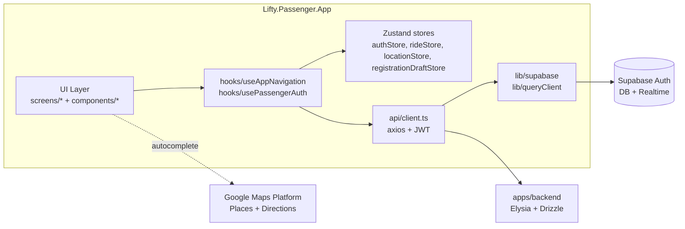
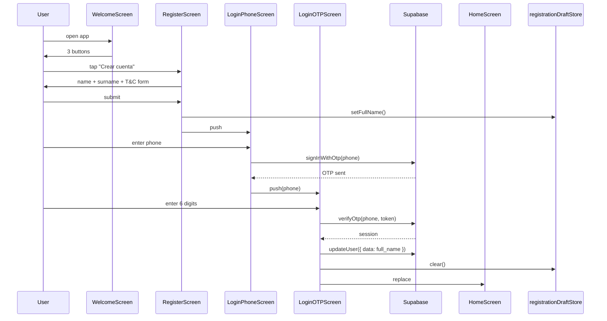

# Architecture Spine — Lifty Passenger App

## Design Paradigm

Layered mobile SPA with **file-based routing** (expo-router) and **feature-sliced client state**. The app is one process, one bundle, mounted at `app/_layout.tsx`. State is split by *kind* (server data vs. UI data vs. cross-screen drafts) and each kind lives in exactly one store.

Layers map to directories:

```
UI (screens, components)
  ↓ hooks
State (zustand stores, React Query)
  ↓ lib
Adapters (axios, supabase)
  ↓ HTTPS
Backend (apps/backend — separate codebase)
```

Two consumers: **users** (people) and **devs** (us, when adding features). Both require the same coherence.

## Inherited Invariants

| Inherited | From parent | Binds here |
| --- | --- | --- |
| Monorepo / Bun workspaces / Turbo | `AGENTS.md` (root) | Build orchestration, package enforcer |
| Bun as runtime + package manager | `AGENTS.md` (root) | No `npm`, no `yarn` |
| Biome linting + format | `AGENTS.md` (root) | No `eslint`, no `prettier` |
| Conventional Commits + GPG `-S` signing | `AGENTS.md` (root) | `git commit -S` mandatory |
| Drizzle migrations + Supabase CLI | `apps/backend/AGENTS.md` | Database shape authority |
| TanStack Query + Zustand + Axios + Zod | `apps/mobile-passengers/AGENTS.md` | Library pinning |

## Invariants & Rules

### AD-1 — Token-only styling

- **Binds:** all UI components, FR-1 through FR-23
- **Prevents:** visual drift between screens, color hex drift between code and design (`App-pasajeros.pen`)
- **Rule:** Component styles must reference `theme.colors.*`, `theme.spacing.*`, `theme.fontSize.*`, `theme.radius.*`, `theme.dimensions.*`. No raw hex values, no `width: "70%"`, no hardcoded font sizes except those in `theme.fontSize`. The driver's app uses `turquoise` / Nunito — those names and values do NOT cross over.

### AD-2 — Domain units in `src/<layer>/`, no cross-layer leak

- **Binds:** AD-1, all directory placement
- **Prevents:** A screen reaching into `src/api/` directly instead of through `src/lib/`; a component reaching into `src/store/`; a store reaching into a screen
- **Rule:** Dependency direction is strict downward (UI → hooks → state → lib → api → backend). Same-layer calls allowed only within `api` (axios + types) and within `store` (zustand). The `components/*` layer never imports from `screens/*` or `store/*`.

```
                          screens/*
                              ↓
                          hooks/*
                              ↓
                          store/* · api/client.ts
                              ↓
                          lib/supabase.ts · api/types.ts
```

### AD-3 — Supabase owns auth, JWT carries user identity

- **Binds:** FR-1, FR-3, FR-4 (auth feature)
- **Prevents:** Bespoke JWT issuance, refresh-token logic, or session storage in our code
- **Rule:** All auth flows go through `supabase.auth.*`. The axios interceptor in `src/api/client.ts` is the SINGLE place that reads the JWT and attaches it to outgoing requests. `supabase.auth.signOut()` is the only sign-out path. After successful auth, the app uses `router.replace('/home')` to prevent back-navigation to OTP.

### AD-4 — Cross-screen drafts go through a dedicated store

- **Binds:** FR-4 (registration name flow), FR-9 (trip request)
- **Prevents:** URL-params-as-state (fragile, breaks on share), shared module-level variables (breaks Strict Mode), `useEffect` chains across screens
- **Rule:** When data must survive across screens but doesn't belong in the backend, it lives in a dedicated Zustand store in `src/store/<name>Store.ts`. Current examples: `authStore`, `rideStore`, `locationStore`, `registrationDraftStore`. Stores never import from `screens/*`.

### AD-5 — expo-router is the navigation contract

- **Binds:** FR-1, FR-9, FR-15, FR-19, all routing
- **Prevents:** Importing from `@react-navigation/*` (removed in SDK 56), using `Linking` directly, hardcoded route strings in screens
- **Rule:** All navigation goes through `useAppNavigation()` from `src/hooks/useAppNavigation.ts`. The hook wraps `useRouter` + `useSegments` and maps PascalCase screen names to kebab-case routes via `SCREEN_TO_ROUTE`. New screens require: (1) `app/<kebab-case>.tsx` re-exporting the screen component, (2) entry in `SCREEN_TO_ROUTE`.

### AD-6 — Theme tokens are the design source of truth

- **Binds:** AD-1, all UI components
- **Prevents:** Hex drift between `App-pasajeros.pen` and code; silent palette divergence over time
- **Rule:** The 28 tokens in `src/theme/index.ts` are the only legal color/spacing/radius/font-size/dimension values. When the `.pen` design changes, the `src/theme/index.ts` changes in the same commit. Token updates require updating `specs/spec-passenger-app/design-tokens.md` and `tokens.json` in lockstep.

### AD-7 — Expo SDK 54 stack pinning

- **Binds:** all `package.json` dependencies in `apps/mobile-passengers`
- **Prevents:** Repeated "wrong package version" incidents (splash-screen 57.x with SDK 56, reanimated 3.x with SDK 54)
- **Rule:** Compatible versions are pinned in `package.json`:
  - `expo: ~54.0.36`
  - `expo-splash-screen: ~31.0.13` (NOT 57.x)
  - `react-native-gesture-handler: ~2.28.0`
  - `react-native-reanimated: ~4.1.1`
  - `react-native: 0.81.5`
  - `expo-router: ~6.0.24`
  - `react: 19.1.0`
  
  New dependencies go through `bunx expo install <pkg>` to pick SDK-54-compatible versions.

### AD-8 — API client owns HTTP, backend owns business logic

- **Binds:** FR-9, FR-10, FR-13, FR-19 — all API calls
- **Prevents:** `fetch` scattered across screens, axios instances per module, manual JWT-attaching in screens
- **Rule:** All HTTP from the app goes through `src/api/client.ts`. The client attaches the Supabase JWT, intercepts 401 → signOut, and sets the base URL from `EXPO_PUBLIC_API_URL`. Endpoint-specific functions live in `src/api/passenger.ts` (or sibling files), typed via `src/api/types.ts`. Screens never call `axios` directly.

### AD-9 — Errors are surfaced, not swallowed

- **Binds:** FR-1 (OTP), FR-9 (trip request), FR-15 (SOS), all interactive flows
- **Prevents:** Silent failures where the user retries without knowing the cause
- **Rule:** Every `try/catch` in screens and hooks must either re-throw, set an error state, or log to a future observability layer. Empty `catch {}` blocks are forbidden in feature code. The 401 handler in `api/client.ts` is the sole exception (it signs out, which is the intended behavior).

## Consistency Conventions

| Concern | Convention |
| --- | --- |
| File naming | `kebab-case` for files (`login-phone.tsx`, `useAppNavigation.ts`), `PascalCase` for components (`LoginPhoneScreen`), `camelCase` for hooks and utilities |
| Component style | Function components only, explicit `interface <Name>Props`, no `React.FC`, exports are named |
| Style organization | `StyleSheet.create({})` at bottom of each file, references to `theme.*` only |
| Imports | Auto-sorted by Biome; do not manually reorder; `import { theme } from '<relative or @/theme>'` |
| Screen file | `<Name>Screen.tsx` in `src/screens/`, re-exported from `app/<kebab-case>.tsx` |
| Error shape | `{ error: string; message?: string }` per `src/api/types.ts` |
| State mutation | Zustand `set({...})` immer-less; never mutate state directly |
| Mutations in screens | `useState` for local form state; `useRideStore`/`useAuthStore` for cross-screen; never both |
| Logging | `console.error` in catch blocks; no custom logger yet |
| Configuration | `EXPO_PUBLIC_*` env vars; typed in `src/types/global.d.ts`; `.env.example` commits, `.env` does not |
| Mocking | `process.env` accesses are typed via `global.d.ts`; runtime substitutions happen at Expo build time |
| Tests | Jest + jest-expo; `__tests__/` subfolder next to the file under test; `@testing-library/react-native` |

## Stack

| Name | Version |
| --- | --- |
| Expo SDK | 54 |
| React | 19.1.0 |
| React Native | 0.81.5 |
| expo-router | ~6.0.24 |
| expo-location | ~19.0.8 |
| expo-notifications | ~0.32.17 |
| expo-splash-screen | ~31.0.13 |
| expo-font | ~14.0.12 |
| expo-status-bar | ~3.0.9 |
| expo-web-browser | ~15.0.11 |
| @expo-google-fonts/inter | ^0.4.0 |
| @supabase/supabase-js | ^2.108.2 |
| @tanstack/react-query | ^5.101.2 |
| axios | ^1.18.1 |
| zustand | ^5.0.14 |
| zod | ^4.4.3 |
| react-native-gesture-handler | ~2.28.0 |
| react-native-reanimated | ~4.1.1 |
| react-native-safe-area-context | ~5.6.0 |
| react-native-screens | ~4.16.0 |
| @react-native-async-storage/async-storage | 2.2.0 |
| @react-native-community/netinfo | 11.4.1 |
| Biome | ^1.9.4 |
| Bun | 1.3.14 |

## Structural Seed

### System boundary



### Source tree

```text
apps/mobile-passengers/
├── app/                            # expo-router file-based routes
│   ├── _layout.tsx                 # root stack, AuthProvider + QueryClientProvider
│   ├── index.tsx                   # → Welcome
│   ├── login-phone.tsx
│   ├── login-otp.tsx
│   ├── register.tsx
│   ├── terms.tsx
│   ├── home.tsx
│   ├── trip-request.tsx
│   ├── trip-in-progress.tsx
│   ├── trip-complete.tsx
│   ├── trip-history.tsx
│   ├── trip-detail.tsx
│   ├── profile.tsx
│   ├── profile-edit.tsx
│   ├── payment-method.tsx
│   ├── chat.tsx
│   ├── forgot-password.tsx
│   └── login-credentials.tsx
├── src/
│   ├── api/                        # HTTP layer
│   │   ├── client.ts               # axios + JWT interceptor + 401 handler
│   │   ├── types.ts                # API response types (PassengerProfile, Trip, FareEstimate, etc.)
│   │   └── passenger.ts            # endpoint functions (planned)
│   ├── components/                 # reusable UI
│   │   ├── Button.tsx              # variants: primary | secondary | danger | cta
│   │   ├── Input.tsx
│   │   ├── OTPInput.tsx
│   │   ├── Card.tsx
│   │   └── SponsorBanner.tsx
│   ├── context/
│   │   └── AuthContext.tsx         # inits session, listens to onAuthStateChange
│   ├── hooks/
│   │   ├── useAppNavigation.ts     # SCREEN_TO_ROUTE mapping
│   │   └── usePassengerAuth.ts     # wraps authStore for screens
│   ├── lib/
│   │   ├── supabase.ts             # supabase client
│   │   ├── queryClient.ts          # React Query client
│   │   ├── websocket.ts            # (planned) location WS
│   │   └── notifications.ts        # (planned) push notifications
│   ├── screens/                    # Screen components (PascalCase + Screen)
│   ├── store/                      # Zustand stores
│   │   ├── authStore.ts            # session state
│   │   ├── rideStore.ts            # active trip, pickup, destination
│   │   ├── locationStore.ts        # current GPS + permission
│   │   └── registrationDraftStore.ts  # name carried from Register → LoginOTP
│   ├── theme/
│   │   └── index.ts                # 28 design tokens, single source
│   ├── types/
│   │   └── global.d.ts             # process.env types
│   └── utils/                      # (planned) validators, formatters, geo
├── design/
│   └── App-pasajeros.pen           # Pencil source of truth
├── assets/
│   └── icon.png
├── AGENTS.md
├── package.json
├── app.json
├── tsconfig.json
└── .env.example
```

### Auth flow



## Capability → Architecture Map

| Capability / Area | Lives in | Governed by |
| --- | --- | --- |
| Auth (FR-1, FR-3, FR-4) | `screens/(Welcome, LoginPhone, LoginOTP, Register, Terms)Screen.tsx`, `lib/supabase.ts`, `context/AuthContext.tsx`, `store/authStore.ts` | AD-3, AD-5, AD-7 |
| Trip request (FR-5..FR-9) | `screens/(home, select-pickup, select-destination, fare-review)`, `store/rideStore.ts`, `api/passenger.ts` | AD-4, AD-8, AD-9 |
| Trip lifecycle (FR-10..FR-15) | `screens/(trip-in-progress, ride-driver-found, ride-verification)`, `api/passenger.ts`, `store/rideStore.ts` | AD-4, AD-8 |
| SOS (FR-15) | `screens/ride-sos.tsx`, `api/passenger.ts` | AD-9 |
| Post-trip (FR-16..FR-18) | `screens/(trip-complete, trip-rating, rating)`, `api/passenger.ts` | AD-8 |
| History (FR-19, FR-20) | `screens/(history-list, trip-detail)`, `api/passenger.ts` | AD-8 |
| Profile (FR-21..FR-23) | `screens/(profile-main, profile-edit)`, `store/authStore.ts` | AD-3 |
| Theme (all UI) | `theme/index.ts` | AD-1, AD-6 |
| Navigation (all) | `app/_layout.tsx`, `hooks/useAppNavigation.ts` | AD-5 |
| Telemetry / logging | `console.error` everywhere, no structured layer | AD-9 (constraint) |

## Deferred

- **Map provider decision**: OQ-1. Affects how `screens/home.tsx` and `screens/set-pickup.tsx` import map SDK. Currently deferred — `react-native-maps` is the default until decided.
- **WebSocket transport for tracking**: AD-4 says "polling in MVP", WebSocket deferred. Affects `lib/websocket.ts` (planned but not implemented).
- **Real-time price recalculation**: not in MVP.
- **i18n / locale**: Spanish only in MVP. All strings inline in components; no i18n layer.
- **Dark mode**: theme defines tokens but screens hardcode `theme.colors.white`/`deepBlue`. Deferred.
- **Push notification setup**: `lib/notifications.ts` is planned but not implemented. Deferred.
- **Real accessibility audit (WCAG 2.1 AA)**: not in MVP.
- **Code-splitting / lazy loading**: bundle is small enough; deferred.
- **Offline support**: not in MVP. Network errors are surfaced but no offline cache.
- **Analytics / telemetry**: deferred.
- **E2E test suite**: deferred — current testing is unit-only via Jest.
