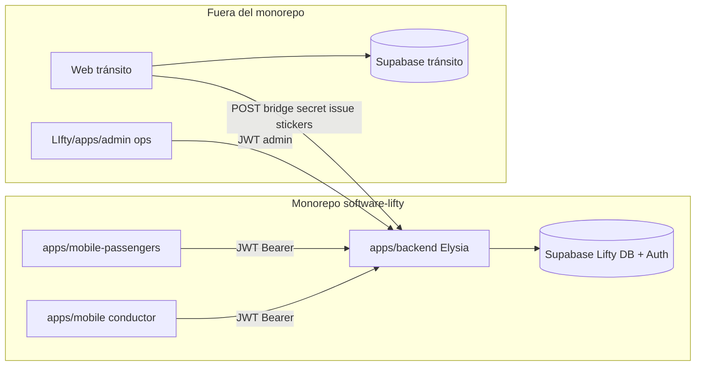
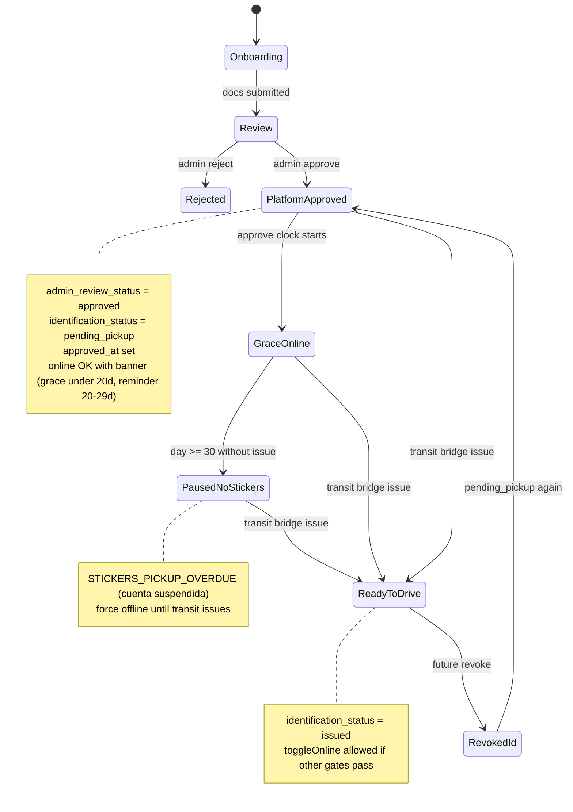

# Architecture — Admin panel + stickers hard gate

Companion de `SPEC-admin-panel-stickers-gate`.

## Context diagram



## Two axes of driver readiness



**Axis A — Platform review** (Lifty admin): `drivers.status` / `admin_review_status`, documents, KYC.  
**Axis B — Physical identification** (tránsito via bridge): `identification_status` + reloj desde `approved_at` (20d reminder / 30d suspensión).

Conducir requiere Axis A + `district_id` + no docs pending. Axis B **no** bloquea online hasta suspensión (30d) o `revoked`.

## Data model (Lifty)

### `drivers` — columnas nuevas

| Column | Type | Notes |
|--------|------|--------|
| `identification_status` | varchar(30) not null | default al crear fila: `pending_pickup` **o** solo setear en primer approve; ver migración |
| `identification_issued_at` | timestamptz null | set en issue |
| `identification_external_ref` | varchar/text null | opcional id de entrega en web-tránsito |

**Valores `identification_status`:**

| Value | Meaning |
|-------|---------|
| `pending_pickup` | Falta retirar stickers en tránsito |
| `issued` | Entrega confirmada por bridge |
| `revoked` | Reservado; si se usa → forzar offline y bloquear online |

### Migración / backfill

Recomendación de esta architecture:

1. Add columns.
2. Backfill: todos los drivers existentes con `identification_status = 'pending_pickup'`.
3. Si ops necesita grandfather de cuentas de prueba ya “reales”, script one-off o SQL manual → `issued` (no default automático a issued).

Al **approve** plataforma: si status identification es null/legacy → `pending_pickup`; si ya `issued` no pisar a pending (re-approve edge).

### Qué no se modela acá

- Sede, horarios, stock de calcomanías, operador municipal → web-tránsito / su DB.
- Tabla `sticker_events` full audit: opcional Phase 3; MVP con columnas en `drivers` + logs backend alcanza.

## Backend touchpoints

| Concern | Where today | Change |
|---------|-------------|--------|
| Approve API | `features/admin/service.ts` `reviewDriver` | set identification pending; copy |
| Approve one-click | `features/admin/approve.ts` | idem |
| Notify copy | `features/admin/notifications.ts` | no “ya conducir” |
| Online gate | `features/drivers/service.ts` `toggleOnline` + heartbeat | plazo 20/30; `STICKERS_PICKUP_OVERDUE` / `STICKERS_REVOKED` |
| Status payload | `getMyStatus` | expose `identification_status` + phase/flags |
| Bridge | `features/transit-bridge` | issue endpoint |
| Admin list/detail | `adminService` | return identification fields + phase |

### `toggleOnline` gate order (conceptual)

```
if turning on:
  deny if documents_pending_review     → DOCUMENTS_UNDER_REVIEW
  deny if status !== 'approved'        → DRIVER_NOT_APPROVED
  deny if !district_id                 → DISTRICT_REQUIRED
  evaluate stickers clock (approved_at):
    pending_pickup < 30d               → allow (soft reminder UI; stronger from day 20)
    pending_pickup >= 30d              → STICKERS_PICKUP_OVERDUE (+ force offline / suspend)
    revoked                            → STICKERS_REVOKED
    issued                             → no sticker block
  else set is_online true
```

Matching ya filtra `is_online=true`; no confiar solo en eso para writes: el gate está en toggle (+ heartbeat force-offline).

## Admin ops (Phase 2) — fuera del monorepo

```
/home/marti/Documentos/LIfty/apps/admin/
  package.json
  vite.config.ts
  index.html
  src/main.tsx
  src/App.tsx
  src/lib/supabase.ts
  src/lib/api.ts
  src/pages/...
```

- Auth: same Supabase **Lifty** project as mobile (publishable key + session).
- API base: `VITE_API_URL` → monorepo backend `:3001`.
- After login, call `/auth/me` o pending list; if role ≠ admin, sign out + error.
- **Not** a Bun workspace of `software-lifty` (same pattern as `web-transito`).

```bash
cd /home/marti/Documentos/LIfty/apps/admin && bun run dev   # :5174
```

## Mobile conductor (Phase 1 mínimo)

- Types: `identification_status` on driver status schema.
- Online toggle / connect path: disable + message when not `issued`.
- Optional: route step `pending_stickers` later; MVP puede quedarse en `Active` con banner (como docs under review).
- Push types: keep `kyc:approved` for platform approve but body text = ir a tránsito; new type opcional `identification:issued` on bridge.

## Security

| Surface | Auth |
|---------|------|
| Admin UI (`LIfty/apps/admin`) + `/admin/*` | Supabase JWT + `users.role=admin` |
| Bridge issue | Shared secret header only (server-server) |
| Driver app | Supabase JWT driver; **cannot** call bridge |
| One-click email approve | existing token; only platform axis |

Rate-limit bridge by IP + secret failure logging.

## Env vars (nombres propuestos)

| Var | Side | Purpose |
|-----|------|---------|
| `TRANSIT_BRIDGE_SECRET` | backend Lifty | validate bridge |
| same secret | web-tránsito server | send bridge calls |
| `VITE_SUPABASE_URL` / `VITE_SUPABASE_ANON_KEY` | LIfty/apps/admin | Lifty auth |
| `VITE_API_URL` | LIfty/apps/admin | monorepo backend |

## Out of scope architecture

- Unificar proyectos Supabase.
- RLS cross-project.
- Event bus / queue (overkill MVP; HTTP sync issue is enough).
