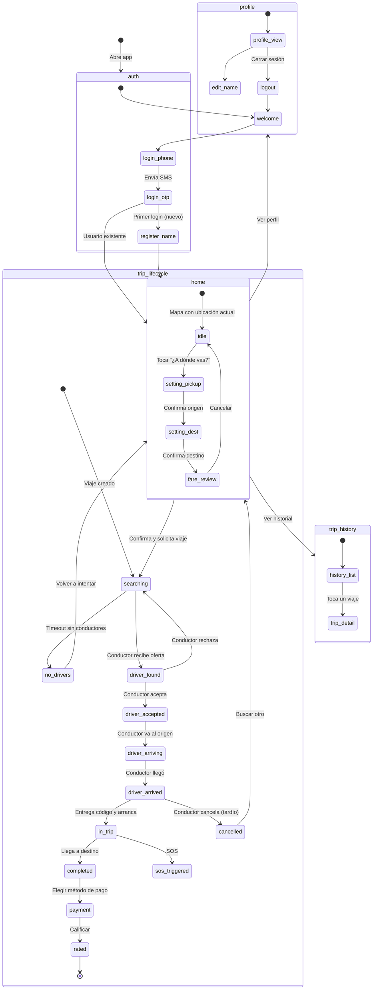
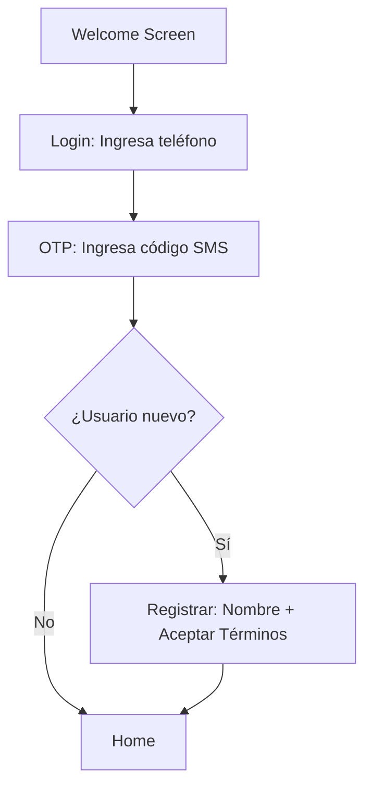
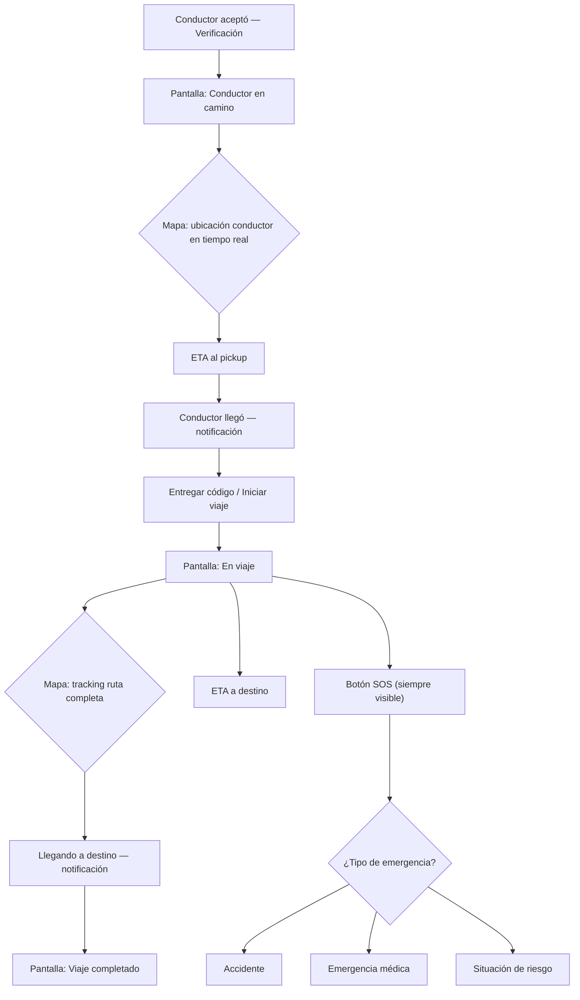
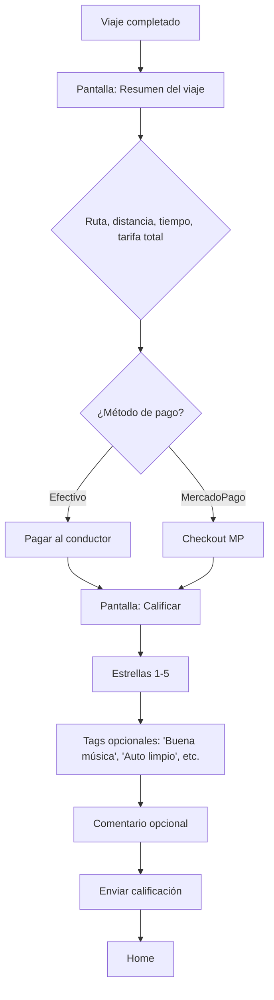
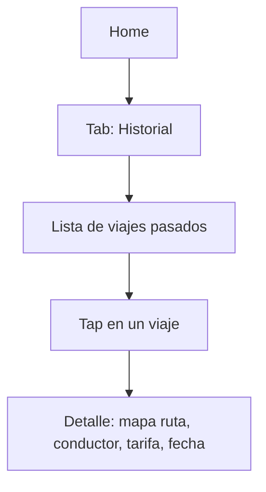
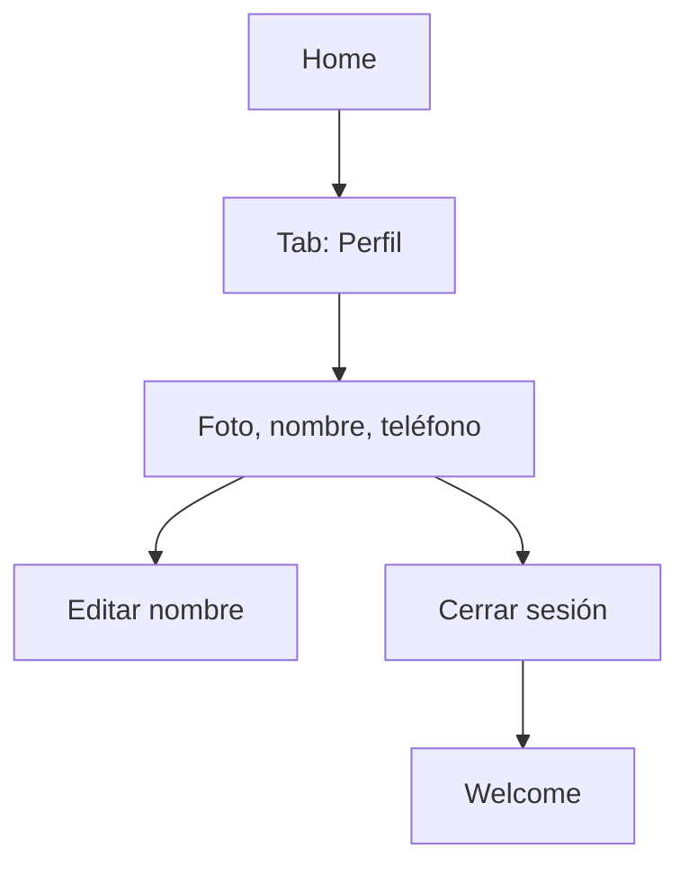

# Lifty Passenger App — Flows & State Machine

## Flujo Global (Mermaid)



---

## Flujo 1: Onboarding / Auth



**Pantallas:**
1. Welcome — logo, "Viajá con Lifty", botón "Ingresar"
2. LoginPhone — input de teléfono (prefijo +54 fijo)
3. LoginOTP — input 6 dígitos
4. RegisterName — nombre, apellido, aceptar términos

**Backend:** Supabase Auth (mismo que driver, role='passenger'). Endpoint `POST /auth/me` ya existe.

---

## Flujo 2: Solicitar Viaje (Core Flow)

```mermaid
flowchart TD
    A[Home: Mapa centrado en GPS] --> B["Toca '¿A dónde vas?'"]
    B --> C[Pantalla: Elegir origen]
    C --> D{¿Ubicación actual?}
    D -->|Sí| F[Pantalla: Elegir destino]
    D -->|No| E[Buscar dirección / mover pin]
    E --> F
    
    F --> G[Autocomplete / buscar en mapa]
    G --> H[Pantalla: Revisar viaje]
    
    H --> I{Muestra: mapa ruta, distancia, tarifa estimada}
    I --> J[Seleccionar vehículo: Auto | Moto]
    J --> K{Opcional: instrucciones de pickup}
    K --> L["Botón: 'Confirmar viaje'"]
    
    L --> M[Pantalla: Buscando conductor]
    M --> N{¿Timeout 30s?}
    N -->|Sí| O["Sin conductores disponibles"]
    N -->|No| P[Conductor encontrado]
    O --> A
    
    P --> Q[Muestra: foto, nombre, rating, vehículo, patente]
    Q --> R{¿Conductor acepta?}
    R -->|Rechaza| M
    R -->|Timeout 15s| M
    R -->|Acepta| S[Pantalla: Código de verificación]
```

**Pantallas:**
1. Home — mapa interactivo, botón "¿A dónde vas?", barra inferior (Home, Historial, Perfil)
2. SetPickup — mapa con pin movable, input de dirección con autocomplete
3. SetDestination — ídem para destino
4. FareReview — resumen: ruta en mapa, distancia, tiempo estimado, tarifa desglosada, selector vehículo
5. SearchingDriver — animación "buscando", posibilidad de cancelar
6. DriverFound — tarjeta del conductor con foto, nombre, rating, vehículo
7. VerificationCode — código 4 dígitos gigante, "mostrale este código a tu conductor"

**Backend necesario:**
- `GET /maps/places/autocomplete?input=` ✅ YA EXISTE
- `GET /maps/geocode?lat=&lng=` ✅ YA EXISTE  
- `GET /maps/directions?origin_lat=&origin_lng=&dest_lat=&dest_lng=` ✅ YA EXISTE
- `POST /maps/fare-estimate` ✅ YA EXISTE
- `POST /trips/request` ❌ **HAY QUE CREAR** — pasajero crea viaje (origen, destino, vehicle_type)
- `GET /trips/active` ❌ **HAY QUE ADAPTAR** — versión pasajero (filtra por passenger_id)
- Polling/Subscription al status del viaje ❌ **HAY QUE CREAR** — Supabase Realtime o polling

---

## Flujo 3: Viaje en Curso (Tracking + SOS)



**Pantallas:**
1. DriverArriving — mapa con ubicación del conductor, ETA, tarjeta conductor
2. DriverArrived — notificación "llegó", botón para ver código
3. InTrip — mapa con ruta, ETA, conductor info, botón SOS flotante
4. SOS — selector de tipo de emergencia, confirmación

**Backend necesario:**
- Ubicación del conductor en tiempo real ❌ **HAY QUE EXPONER** — hoy el broadcast va a Supabase Realtime, el pasajero necesita suscribirse
- `POST /sos` ✅ YA EXISTE (requiere auth, pero con passenger_id)
- `GET /trips/:id` ❌ **HAY QUE ADAPTAR** — versión pasajero

---

## Flujo 4: Post-Viaje (Pago + Calificación)



**Pantallas:**
1. TripSummary — resumen visual: mapa ruta, distancia, tiempo, tarifa, método pago
2. Rating — estrellas, tags, comentario

**Backend necesario:**
- `POST /ratings/trips/:trip_id` ✅ YA EXISTE (rater_id es el pasajero, ratee_id el conductor)
- Pago MercadoPago: el checkout lo inicia el frontend del pasajero con MP SDK, el backend solo recibe el webhook ✅ YA EXISTE
- `PUT /trips/:id/collect` ❌ versión pasajero? O se maneja distinto

---

## Flujo 5: Historial de Viajes



**Pantallas:**
1. TripHistoryList — lista con: dirección, fecha, tarifa, rating (estrellas)
2. TripDetail — mapa de la ruta, info conductor, desglose tarifa

**Backend necesario:**
- `GET /trips/history` ❌ **HAY QUE ADAPTAR** — versión pasajero

---

## Flujo 6: Perfil



**Pantallas:**
1. Profile — avatar, nombre, teléfono
2. EditProfile — editar nombre

**Backend necesario:**
- `GET /auth/me` ✅ YA EXISTE
- `PUT /drivers/me` ❌ para pasajero sería tipo `PUT /passengers/me` o un endpoint genérico `/users/me`

---

## Resumen: Lo que FALTA en el backend

| # | Endpoint | Prioridad | Notas |
|---|----------|-----------|-------|
| 1 | `POST /api/trips/request` | **CRÍTICO** | Pasajero crea viaje |
| 2 | `GET /api/trips/active` (passenger) | **CRÍTICO** | Viaje activo del pasajero |
| 3 | `GET /api/trips/:id` (passenger) | **CRÍTICO** | Detalle para pasajero |
| 4 | `GET /api/trips/history` (passenger) | ALTA | Historial |
| 5 | Driver tracking (realtime) | **CRÍTICO** | El pasajero necesita ver al conductor |
| 6 | `POST /api/trips/:id/cancel` (passenger) | ALTA | Cancelar como pasajero |
| 7 | `PUT /api/users/me` | MEDIA | Perfil pasajero |
| 8 | `GET /api/drivers/nearby` | MEDIA | Para mostrar conductores en el mapa |

## Resumen: Pantallas del MVP

| # | Pantalla | Flujo | Complejidad |
|---|----------|-------|-------------|
| 1 | Welcome | Auth | Baja |
| 2 | LoginPhone | Auth | Baja |
| 3 | LoginOTP | Auth | Baja |
| 4 | RegisterName | Auth | Baja |
| 5 | **Home** | Solicitar | **ALTA** (mapa interactivo) |
| 6 | SetDestination | Solicitar | Media (autocomplete + mapa) |
| 7 | FareReview | Solicitar | Media |
| 8 | SearchingDriver | Solicitar | Baja (animación + polling) |
| 9 | DriverFound | Solicitar | Media |
| 10 | VerificationCode | Solicitar | Baja |
| 11 | **DriverTracking** | En viaje | **ALTA** (mapa real-time) |
| 12 | InTrip | En viaje | Media |
| 13 | SOS | En viaje | Baja |
| 14 | TripSummary | Post-viaje | Media |
| 15 | Rating | Post-viaje | Baja |
| 16 | TripHistoryList | Historial | Baja |
| 17 | TripDetail | Historial | Media |
| 18 | Profile | Perfil | Baja |

**Total: 18 pantallas** (vs 35 del driver, tiene sentido — el pasajero no tiene onboarding complejo)
